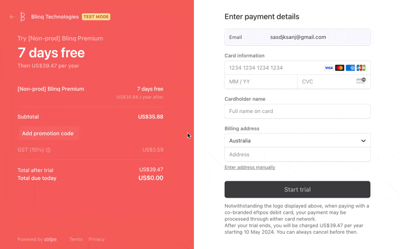

### Stripe Elements Filler

Fill annoying stripe test page using `control + p` on a mac -

## How to install

1. Clone this directory
2. Go to chrome://extensions/ in url bar
3. Toggle developer mode
4. Click "Load unpacked extension"
5. Select the directory of the cloned repo

## How to update

1. Make any code changes locally
2. Press update on the chrome extension details

## Example

